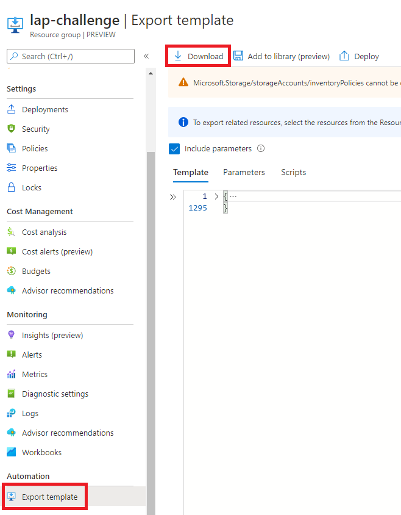

# Logic App Challenge

## Synopsis

Create a Logic App that can read from the GitHup REST API, retrieve closed pull requests from the repository and, write each PR object as a json file in Azure Blob Storage.

## Instructions

1. Clone this repository and push to your own public GitHub Repository **do not fork**.
2. Deploy the ARM Template to your Azure Subscription.
   - You can click the "Deploy to Azure" button above or, 
   - run the PowerShell script [deploy.ps1](deploy.ps1)
3. Check that the resources have deploy successfully
4. Modify the Logic App. It will be named `lap-test-[unique-id]` where the `unique-id` is a generated name
   - The Logic App should read from [https://api.github.com/repos/mrsmitty/logic-app-challenge/pulls?status=closed](https://api.github.com/repos/mrsmitty/logic-app-challenge/pulls?status=closed)
   - Each item should be written to the Storage Account `laptest[unique-id]` in the container `pull-requests`
   - Each file should use the `id` property from each item as the name and have the `.json` file extension e.g. `678231.json`
5. Export your Resource Group ARM Template `*.zip` file. Extract it to your repository and push your change.

## **Bonus Points!**

Once you have a working solution, update `azuredeploy.json` with your Logic App definition. Also include any connections required by the logic app. Modify the template so that it can be configured to run in any Azure Subscription and any Resource Group using the [deploy.ps1](deploy.ps1) command.

## References
- [List Pull Requests](https://docs.github.com/en/rest/reference/pulls#list-pull-requests)
- [Microsoft.Logic workflows template reference](https://docs.microsoft.com/en-us/azure/templates/microsoft.logic/workflows)

